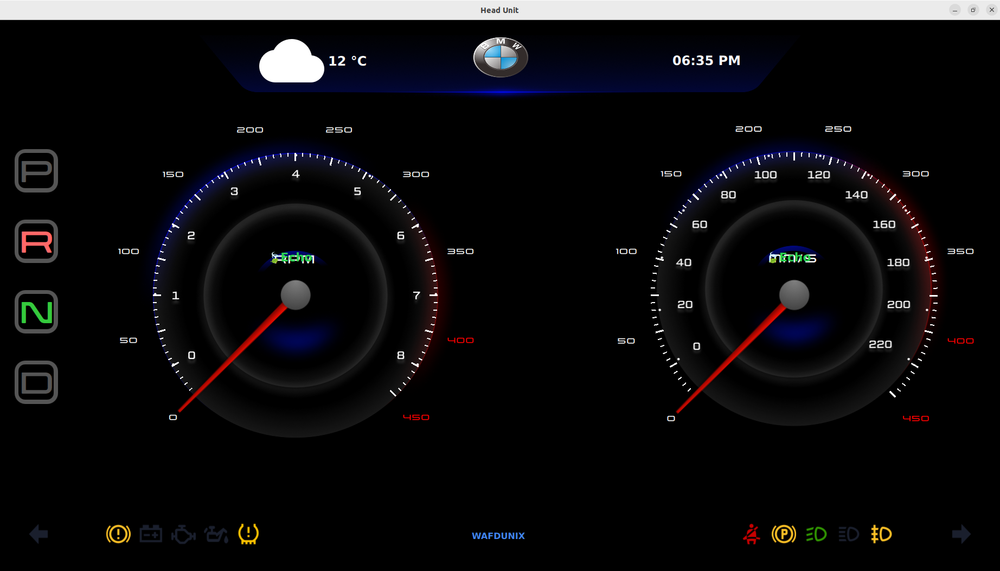
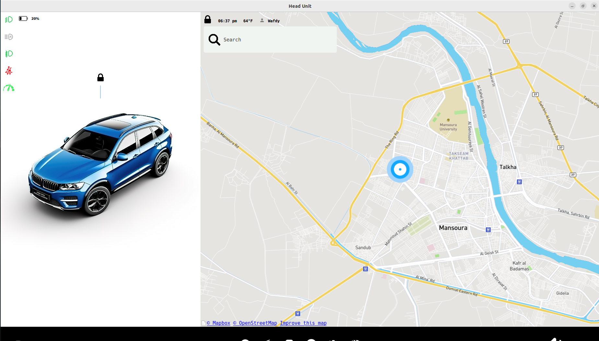
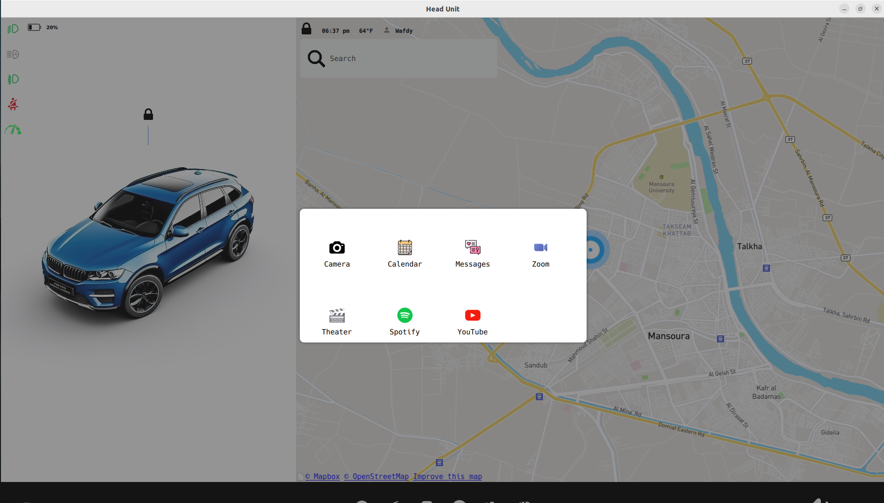

# ECU-HeadUnit

This repository is for the ECU-HeadUnit part of the Autonomous-Driving-System project. The ECU-HeadUnit is based on an independent RaspberryPi board and displays information such as the vehicle's driving status and location on the head unit screen. The head unit was developed with QT5 and interacts with ECU-Core via CAN communication. This repository includes the head unit developed in Ubuntu OS. By following the documentation, you can set up the environment and run the head unit on Ubuntu. However, in the overall project, this head unit runs in an OS based on the Yocto Project and is updated via OTA.

## Screenshots

<div align="center">
  
  <p><em>Main interface of the Head Unit</em></p>
  
  
  <p><em>Navigation display with vehicle status</em></p>
  
  
  <p><em>Vehicle settings and configuration panel</em></p>
</div>

## Features

- Displays vehicle driving status
- Shows vehicle location
- Developed with QT5
- Interacts with ECU-Core via CAN communication
- Runs on Ubuntu OS for development
- Runs on Yocto Project-based OS for production
- Supports OTA updates

## Setup and Installation

To set up the environment and run the head unit on Ubuntu, follow these steps:

1. Clone the repository:
    ```sh
    git clone -b adas https://github.com/AhmedAdelWafdy7/ECU-HEAD.git
    cd ECU-HeadUnit
    mkdir build && cd build
    cmake ..
    make
    cd ..
    sh can_setup.sh
    sh run.sh
    ```

2. Install the required dependencies:
    ```sh
    sudo apt-get update
    sudo apt-get install qt5-default qtcreator
    sudo apt install qtdeclarative5-dev
    sudo apt install qml-module-qtquick-controls
    sudo apt install qml-module-qtquick-extras
    sudo apt install libqt5serialbus5*
    ```

3. Build the project:
    ```sh
    mkdir build
    cd build
    qmake ..
    make
    ```

4. Run the head unit application:
    ```sh
    ./ECU-HeadUnit
    ```

## Documentation

For more detailed information, refer to the Autonomous-Driving-System project documentation.

## License

This project is licensed under the MIT License. See the LICENSE file for details.

## Acknowledgements

- QT5
- Yocto Project
- RaspberryPi

For any questions or support, please contact ahmedadelwafdy782@gmail.com.